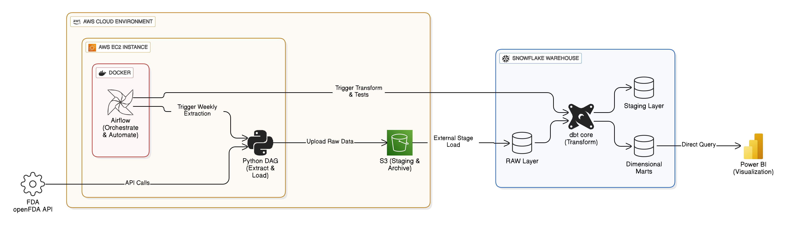
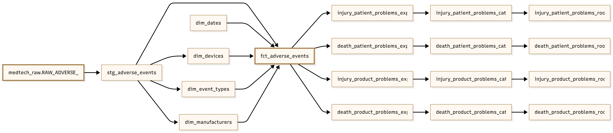
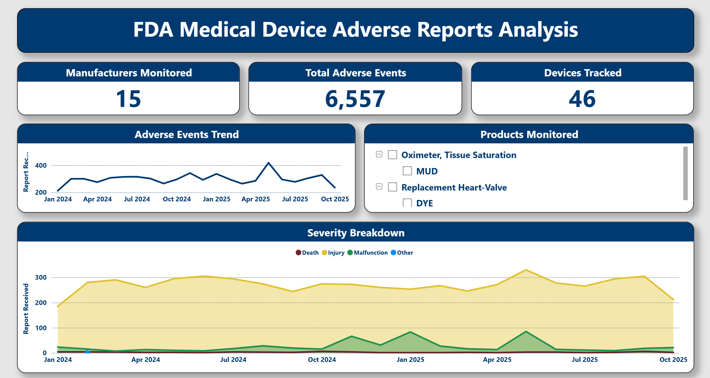
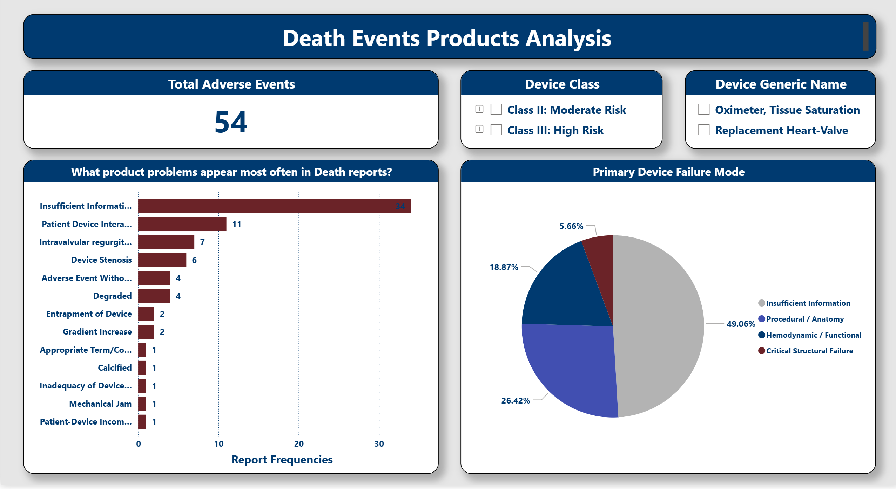
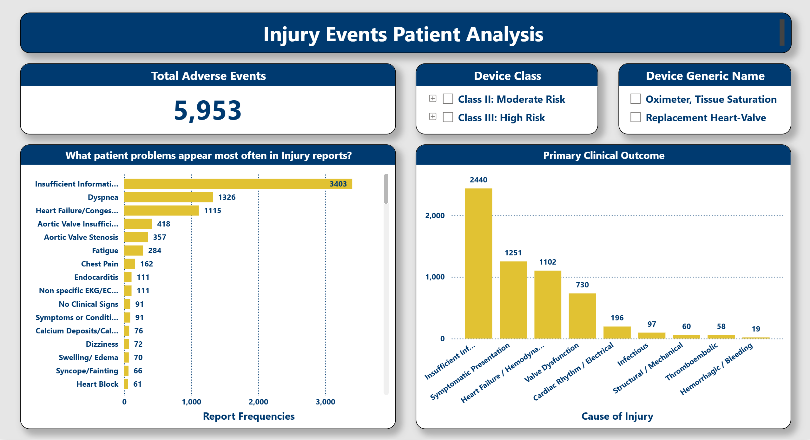

# MedTech Sentinel: FDA Adverse Event Pipeline

[](https://aws.amazon.com/)
[](https://aws.amazon.com/s3/)
[](https://aws.amazon.com/ec2/)
[](https://ubuntu.com/)
[](https://airflow.apache.org/)
[](https://www.docker.com/)
[](https://www.python.org/)
[](https://en.wikipedia.org/wiki/SQL)
[](https://www.snowflake.com/)
[](https://www.getdbt.com/)
[](https://powerbi.microsoft.com/)
[](https://learn.microsoft.com/en-us/dax/)
[](https://github.com/)

An automated cloud pipeline that extracts FDA adverse event reports weekly, transforms raw data into analytics-ready models, and enables medical device safety monitoring through interactive dashboards.

---

## Business Objective

This pipeline automates post-market surveillance for medical devices by monitoring FDA adverse event reports for heart valves and pulse oximeters. Quality engineers and regulatory teams use the resulting dashboards to identify safety trends, compare manufacturer performance, and detect emerging risk patterns. Key technical capabilities:

- **Cloud deployment** — runs entirely on AWS (EC2, S3) independent of local machines
- **Containerized orchestration** — Airflow runs in Docker for consistent, portable execution
- **Live API integration** — extracts from openFDA API with pagination and rate limit handling
- **Staging layer architecture** — S3 provides durable storage, audit trails, and reprocessing capability
- **External stage loading** — Snowflake ingests directly from S3 via IAM trust relationships
- **Incremental processing** — extracts only new weekly data, not full reloads
- **Idempotent loads** — safe to rerun or backfill without creating duplicates
- **Dimensional modeling** — star schema with fact and dimension tables optimized for analytics
- **Layered transformations** — staging → intermediate → marts separation in dbt
- **Data quality testing** — automated dbt tests validate transformations before dashboard refresh
- **Automated orchestration** — Airflow schedules weekly runs with error handling and retries

> **Note**: The pipeline processes real FDA MAUDE database reports. Current dataset includes 6,557 adverse events spanning heart valves (product code DYE) and pulse oximeters (product code MUD).

---

## Architecture



> The pipeline runs on an AWS EC2 instance with Airflow deployed in Docker containers, enabling fully cloud-based execution independent of local machines.

**Data Flow:**

- Python DAG extracts adverse event data from openFDA API with pagination handling
- Raw JSON files stage in S3, providing durable storage and audit trail
- Snowflake ingests from S3 via external stage using IAM trust relationships
- dbt transforms data through staging (cleaning), dimensions, and marts (analytical models)
- Power BI queries the dimensional marts directly for visualization

**Control Plane:**

- Airflow orchestrates the entire workflow — triggering extraction, S3 upload, Snowflake loading, dbt transformations, and testing in sequence
- Scheduled weekly with retry logic and error handling

---

## Tech Stack


## Pipeline Key Features


---

## Data Model



dbt build data models flowing from the raw FDA source through staging model (cleaning and standardization), into dimensional models including device, manufacturer, and date dimensions, and finally into the fact table (`fct_adverse_events`)  and analytical marts. This layered approach separates data cleaning from business logic and supports efficient queries for safety trend analysis, manufacturer comparison, and event type distribution.

---


## Project Structure

```
medtech-sentinel/
├── airflow/
│   └── dags/
│       ├── extract_fda_events.py  # API extraction and load DAG
├── dbt/
│   ├── models/
│   │   ├── STAGE/                 # Clean raw data
│   │   └── marts/                 # Dimensions & facts
│   ├── dbt_project.yml
├── dashboard/                     # Power BI file
├── documents/                     # Documentation
├── images/                        # README images
├── docker-compose.yaml            # Airflow multi-container
├── Dockerfile                     # Custom image with dbt
└── README.md
```

---

## Dashboard
- The Power BI dashboard provides a 7-page analytical interface for post-market surveillance of medical device adverse events.

- The Overview page presents high-level KPIs (6,557 total events across 15 manufacturers and 46 devices), event trends over time, and severity breakdown by event type. The analysis then splits > into two parallel tracks: Death Events (54 total) and Injury Events (5,953 total).

- Each track includes three focused views: an overview showing distribution by brand and severity profile, a Products Analysis examining what device problems were reported (e.g., device stenosis, calcification, regurgitation) and categorizing them into primary failure modes (Hemodynamic/Functional, Procedural/Anatomy, Critical Structural Failure), and a Patient Analysis exploring clinical outcomes and patient symptoms (e.g., heart failure, dyspnea, cardiogenic shock).

- This separation of product problems versus patient problems provides complementary perspectives — quality engineers can identify what failed on the device while clinical teams understand the patient impact.

- Interactive filters for device class and generic name enable drill-down analysis across heart valves (Class III, high risk) and pulse oximeters (Class II, moderate risk).

---




