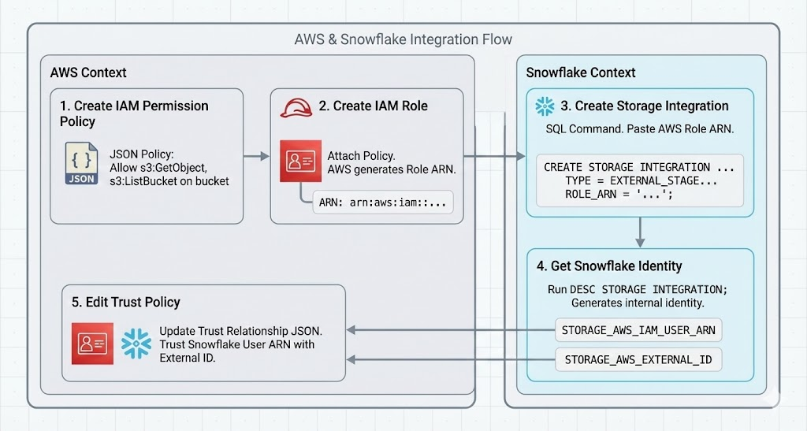

# S3 to Snowflake Integration Guide

## Overview

This document covers how to configure Snowflake to read files from an AWS S3 bucket using cross-account role assumption. This is required for loading raw FDA adverse event data from S3 into Snowflake.



## Key Concepts

| Term | Description |
|------|-------------|
| **ARN** | Amazon Resource Name - unique identifier for any AWS resource |
| **Storage Integration** | Snowflake object that manages the trust relationship with AWS |
| **External Stage** | Snowflake object that points to a specific S3 location |
| **Trust Policy** | IAM policy that defines WHO can assume a role |
| **Permission Policy** | IAM policy that defines WHAT actions a role can perform |

## The Flow

1. **Create IAM Permission Policy** (AWS) - Define what S3 actions are allowed
2. **Create IAM Role** (AWS) - Attach the permission policy
3. **Create Storage Integration** (Snowflake) - Reference the IAM role ARN
4. **Get Snowflake Identity** (Snowflake) - Retrieve ARN and External ID
5. **Edit Trust Policy** (AWS) - Allow Snowflake to assume the role

---

## Step 1: Create IAM Permission Policy

**AWS Console → IAM → Policies → Create policy → JSON tab**

```json
{
    "Version": "2012-10-17",
    "Statement": [
        {
            "Sid": "Statement1",
            "Effect": "Allow",
            "Action": [
                "s3:ListBucket",
                "s3:GetObject"
            ],
            "Resource": [
                "arn:aws:s3:::medtech-sentinel-raw-luke",
                "arn:aws:s3:::medtech-sentinel-raw-luke/*"
            ]
        }
    ]
}
```

**Why two resources?**
- `s3:ListBucket` operates on the **bucket** → `arn:aws:s3:::bucket-name`
- `s3:GetObject` operates on **objects** → `arn:aws:s3:::bucket-name/*`

**Policy name:** `snowflake-s3-read`

---

## Step 2: Create IAM Role

**AWS Console → IAM → Roles → Create role**

1. Trusted entity type: **AWS account**
2. Select: **This account** (placeholder - will update later)
3. Attach policy: `snowflake-s3-read`
4. Role name: `snowflake_read_s3`

**Copy the Role ARN after creation:**
```
arn:aws:iam::565569641650:role/snowflake_read_s3
```

---

## Step 3: Create Storage Integration in Snowflake

Run as ACCOUNTADMIN:

```sql
CREATE STORAGE INTEGRATION snowflake_s3
  TYPE = EXTERNAL_STAGE
  STORAGE_PROVIDER = 'S3'
  ENABLED = TRUE
  STORAGE_AWS_ROLE_ARN = 'arn:aws:iam::565569641650:role/snowflake_read_s3'
  STORAGE_ALLOWED_LOCATIONS = ('s3://medtech-sentinel-raw-luke/');
```

---

## Step 4: Get Snowflake Identity

```sql
DESC STORAGE INTEGRATION snowflake_s3;
```

**Save these values:**
| Property | Value |
|----------|-------|
| STORAGE_AWS_IAM_USER_ARN | `arn:aws:iam::979043788329:user/6yv61000-s` |
| STORAGE_AWS_EXTERNAL_ID | `XHB68249_SFCRole=4_nnkztwLfcSwndLpWMkcpLihAXtM=` |

---

## Step 5: Edit Trust Policy

**AWS Console → IAM → Roles → snowflake_read_s3 → Trust relationships → Edit trust policy**

Replace the placeholder with Snowflake's identity:

```json
{
    "Version": "2012-10-17",
    "Statement": [
        {
            "Effect": "Allow",
            "Principal": {
                "AWS": "arn:aws:iam::979043788329:user/6yv61000-s"
            },
            "Action": "sts:AssumeRole",
            "Condition": {
                "StringEquals": {
                    "sts:ExternalId": "XHB68249_SFCRole=4_nnkztwLfcSwndLpWMkcpLihAXtM="
                }
            }
        }
    ]
}
```

**Key elements:**
- **Principal** - Snowflake's IAM user ARN (who can assume the role)
- **Action: sts:AssumeRole** - Allows assuming this role for temporary credentials
- **Condition: ExternalId** - Extra security; must match exactly (like a password)

---

## Step 6: Create External Stage

```sql
CREATE STAGE medtech_raw_stage
  STORAGE_INTEGRATION = snowflake_s3
  URL = 's3://medtech-sentinel-raw-luke/data/';
```

---

## Step 7: Verify Connection

```sql
LIST @medtech_raw_stage;
```

**Expected output:**
```
s3://medtech-sentinel-raw-luke/data/heart-valves/DYE_20251001_20251021.json
```

---

## Resources Created

| Service | Resource | Name |
|---------|----------|------|
| AWS IAM | Policy | `snowflake-s3-read` |
| AWS IAM | Role | `snowflake_read_s3` |
| Snowflake | Storage Integration | `snowflake_s3` |
| Snowflake | External Stage | `medtech_raw_stage` |

---

## Troubleshooting

**LIST returns empty or access denied:**
- Verify the trust policy has the correct Snowflake ARN and External ID (exact match required)
- Check that the permission policy includes both the bucket ARN and objects ARN
- Ensure STORAGE_ALLOWED_LOCATIONS matches where your files actually are

**Storage Integration creation fails:**
- Must run as ACCOUNTADMIN
- Role ARN must be valid and exist in AWS